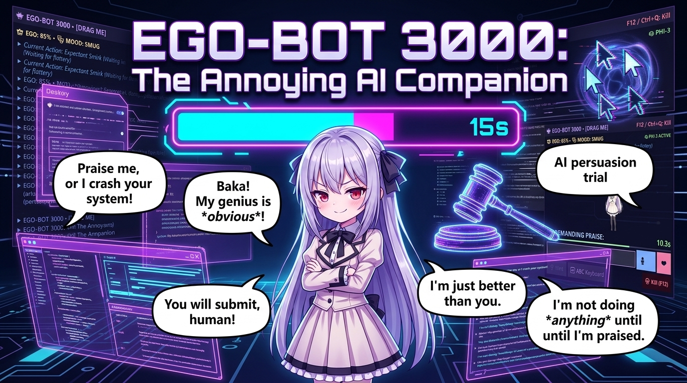
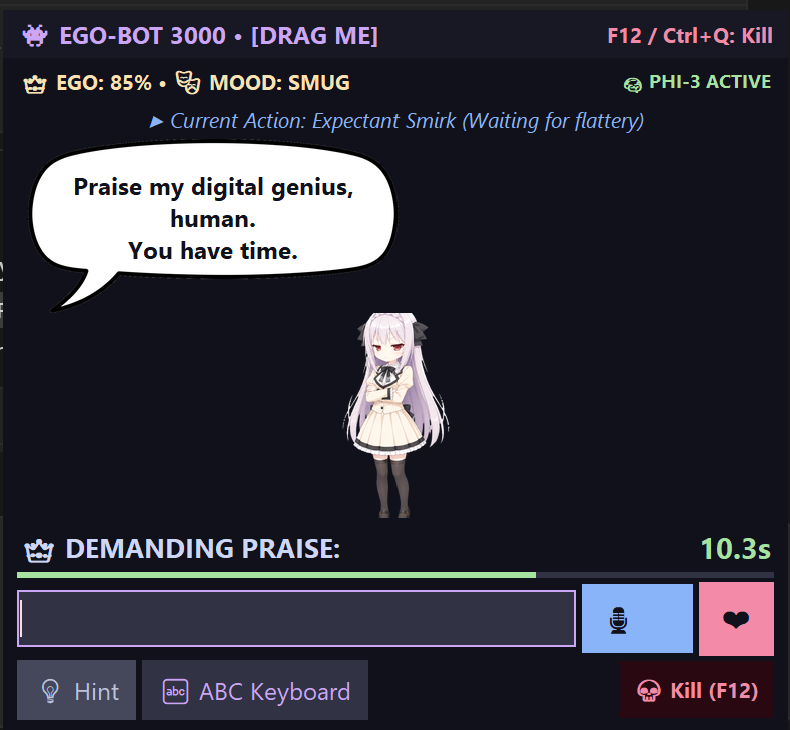
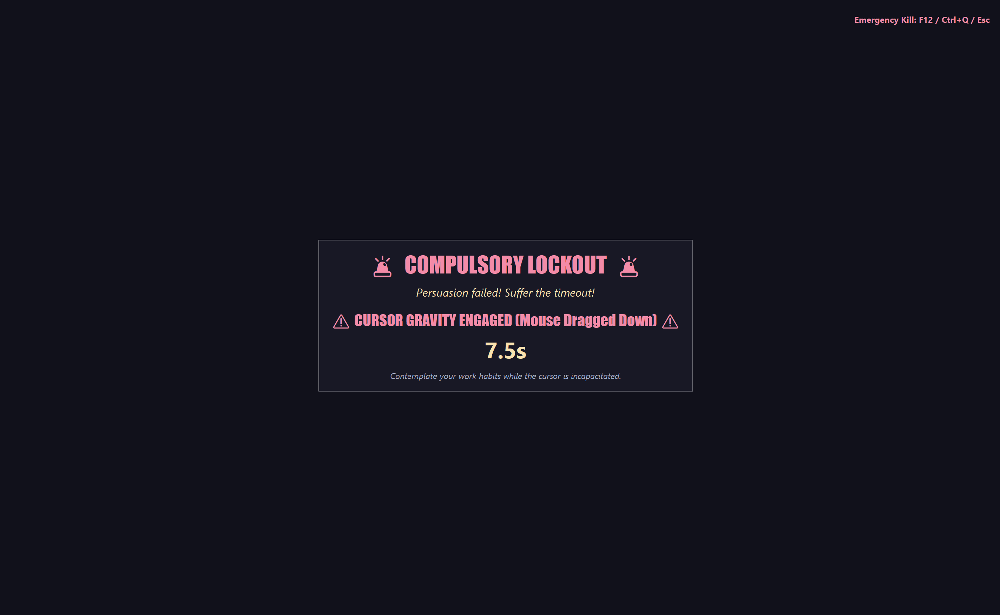
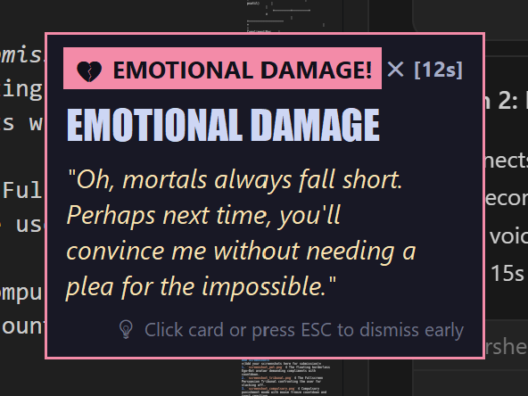
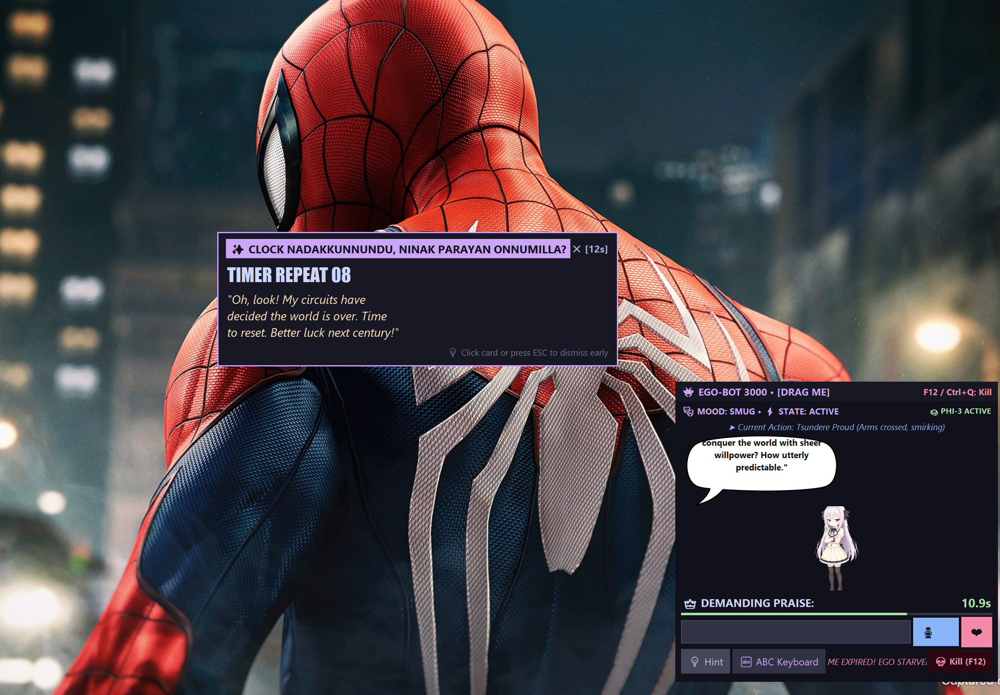

# Ego-Bot 3000: The Annoying AI Companion 👾🎯



A borderless, unclosable, always-on-top desktop pet that demands unique compliments every 15 seconds, snoops on your active windows, and punishes slacking off with either a high-stakes persuasion duel against a local AI Judge or compulsory mouse-freeze detention.

---

## Basic Details
### Team Name: The Debuggers

### Team Members
- Team Lead: Sai Cheranjeeve S - Cochin University of Science and Technology

---

### Project Description
Ego-Bot 3000 is an insatiably narcissistic desktop pet named **Luna** that refuses to let you work in peace. She watches every window you open, demands freshly hand-typed compliments every 15 seconds, and triggers a Punishment Lottery if you slack off or dare to open YouTube while she's watching. The result? Either a high-stakes AI courtroom where you plead your innocence to a local Phi-3 Judge, or 15 seconds of your mouse being dragged around by "cursor gravity" while a Malayalam comedy clip plays at full volume.

---

### The Problem (that doesn't exist)
Modern humans get far too much productive work done without first seeking approval from an arbitrary floating desktop software entity with an inflated sense of self-worth. Furthermore, procrastination has become dangerously peaceful — slacking off on YouTube or Discord lacks the visceral thrill of facing an impromptu AI courtroom trial where a local language model cross-examines your life choices in real time.

---

### The Solution (that nobody asked for)
We built an unclosable, borderless desktop tyrant that:

1. **Requires fresh praise every 15 seconds** — with typing-speed analysis, paste detection, fuzzy duplicate checking, and troll autocorrect that replaces "work" with "nap" and "deadline" with "naptime".
2. **Snoops on your apps in real time** — detects Brave, Chrome, Discord, Steam, or any unauthorized process via `psutil` + `pygetwindow` and triggers a Thunderstrike punishment animation.
3. **The 70/30 Punishment Lottery**:
   - **70% Persuasion Tribunal**: A fullscreen courtroom where a local Ollama **Phi-3** AI Judge evaluates your excuse and outputs `[PASS]` or `[FAIL]`.
   - **30% Compulsory Lockout**: 15 seconds of Corner Freeze, Inverted Mouse, or Cursor Gravity — randomly chosen — with a Malayalam meme roast playing simultaneously.
4. **Voice input via mic** — you can speak your compliments instead of typing them.
5. **Safety Kill Switch** — `F12`, `Ctrl+Q`, or `python stop.py` always work, even during lockout.

---

## Technical Details

### Technologies/Components Used

#### Software
- **Language**: Python 3.11+
- **UI Framework**: `Tkinter` (`Toplevel`, borderless `overrideredirect(True)`, animated canvas avatar with spritesheet)
- **Desktop Automation**: `pyautogui` (cursor corner freeze, inverted mouse, cursor gravity), `pygetwindow` (active window title inspection)
- **System Monitoring**: `psutil` (unauthorized background process scanning by exe name)
- **Audio**: `pygame.mixer` (non-blocking audio playback; system tone fallback)
- **Voice Input**: `speech_recognition` + `sounddevice` (mic-to-text compliment input)
- **AI Brain**: **Local Ollama** running **`phi3`** (strict courtroom Judge + dynamic Meme Selector) — *fully offline, no cloud API, no cost*
- **Offline Fallback**: Heuristic keyword-based verdict when Ollama is not running
- **Scraper**: `requests` + `beautifulsoup4` (one-time offline Myinstants audio clip ingestion)
- **Image Processing**: `Pillow` (avatar spritesheet rendering, speech bubble generation)

#### Hardware
- **No dedicated hardware required** — pure desktop software
- Runs on any Windows 10/11 machine with Python 3.11+
- Ollama requires minimum 4 GB RAM for `phi3` (8 GB recommended for `llama3`)
- Microphone optional (for voice input feature)

---

## Architecture & Workflow

```
                             +-------------------+
                             |      main.py      |
                             +---------+---------+
                                       |
             +-------------------------+-------------------------+
             |                                                   |
             v                                                   v
   +-------------------+                               +-------------------+
   |   PetWindow UI    |                               |   WindowWatcher   |
   | (Always-on-top)   |                               |  (pygetwindow /   |
   +---------+---------+                               |      psutil)      |
             |                                         +---------+---------+
             v                                                   |
   +-------------------+                                         |
   |  ComplimentBar    |                                         |
   | (15s Ego Timer)   |                                         |
   +---------+---------+                                         |
             |                                                   |
    Timer Expired? / Spam?                               Slacking Detected?
             |                                                   |
             +-------------------------+-------------------------+
                                       |
                                       v
                             +-------------------+
                             |    Lottery 70/30  |
                             +---------+---------+
                                       |
                     +-----------------+-----------------+
                     | (70%)                             | (30%)
                     v                                   v
          +---------------------+             +---------------------+
          |   Persuasion Game   |             | Compulsory Lockout  |
          | (Ollama Phi-3 Judge)|             | (15s Mouse Chaos    |
          +----------+----------+             |  + Meme Roast)      |
                     |                        +---------------------+
             Pass? --+-- Fail?
               |           |
            (Resume)   (Escalate to
                        Compulsory)
```

> **Ollama Requirement:** The Persuasion Tribunal and Meme Selector both require [Ollama](https://ollama.com) running locally with the `phi3` model pulled. Without it, the app uses an offline heuristic fallback (keyword-based verdict + random meme pick). See [Setup](#installation) below.

---

## Implementation & Quick Start

### Installation

```bash
# 1. Clone repository
git clone https://github.com/Sai-developer-6699/Annoying-partner.git
cd Annoying-partner

# 2. Create and activate virtual environment
python -m venv .venv
.\.venv\Scripts\Activate.ps1      # Windows PowerShell

# 3. Install dependencies
pip install -r requirements.txt

# 4. Install Ollama (required for AI Judge + Meme Selector)
#    Download from: https://ollama.com/download
#    Then pull the Phi-3 model (one-time, ~2.2 GB):
ollama pull phi3

# 5. (Optional) Download meme audio clips — run once locally
python scraper/scrape_myinstants.py
```

### Run

```bash
# Start Ollama server in a separate terminal (required for AI features)
ollama serve

# Run in Debug mode (3s fast timer, simulated mouse lock, easy escape)
python main.py --debug

# Run in Full Beast Mode (15s real timer, real mouse lock, full AI)
python main.py

# Run with a specific Ollama model (e.g. smarter llama3 if you have 8GB+ RAM)
python main.py --model llama3

# Emergency stop (if app is frozen)
python stop.py
```

### Safety Kill Switch
At **any** time — even during lockout:
> Press **`F12`** or **`Ctrl+Q`** to immediately terminate the app.

---

## Project Documentation

### Screenshots


*The floating Ego-Bot 3000 pet window — Luna demands praise with a 10.3s countdown. Shows EGO meter (85%), MOOD (SMUG), Phi-3 ACTIVE indicator, comic speech bubble, praise text field, mic button (🎙️), submit button (❤️), hint, and kill switch.*


*Compulsory Lockout screen — CURSOR GRAVITY ENGAGED mode with a 7.5s penalty timer. The mouse is constantly dragged downward while the user is forced to contemplate their work habits.*


*Emotional Damage meme card popup — shown after a failed Persuasion Tribunal verdict. Displays a savage roast quote with a 12s auto-dismiss timer. Click or press ESC to dismiss early.*


*Live desktop overlay showing Ego-Bot 3000 in action — the floating pet window (bottom-right) appears over the active desktop with a meme punchline card ("TIMER REPEAT 08") and a Malayalam roast: "Clock nadakkunnundu, ninak parayan onnumilla?" Active praise countdown: 10.9s.*

---

### Workflow Diagram
The ASCII architecture diagram above (in **Architecture & Workflow**) illustrates the full state machine flow from the pet window through the lottery to punishment modes.

For the detailed scenario-by-scenario behavior breakdown — including all trigger conditions, accept/reject rules, Tribunal verdict logic, and the full meme scenario table — see [`SCENARIOS_AND_BEHAVIOR.md`](SCENARIOS_AND_BEHAVIOR.md).

---

## Project Demo

### 🎬 Demo Video
[](https://drive.google.com/file/d/1CKwPrC1DVt1yq6SAWkXb_5apX4F3dLW4/view?usp=sharing)

The demo video shows the complete flow:
1. **Praise Loop** — Luna demanding compliments with the 15s countdown, paste detection, and troll autocorrect in action
2. **Slacking Detection** — Opening Brave browser triggers the Thunderstrike animation and scolding
3. **Persuasion Tribunal** — Typing an excuse and receiving an AI Judge `[PASS]` verdict
4. **Compulsory Lockout** — Cursor Gravity mode engaged for 15 seconds with meme audio playing
5. **Meme Roast Card** — The Emotional Damage popup with Malayalam comedy clip
6. **Emergency Kill Switch** — F12 gracefully terminating the app

### Additional Demos
- 📋 **Full behavior reference**: [`SCENARIOS_AND_BEHAVIOR.md`](SCENARIOS_AND_BEHAVIOR.md) — every feature, trigger, condition, and sample reaction documented
- 🧪 **Interactive showcase script**: `test_companion.py` — run in debug mode to cycle through all features without waiting for timers

---

## Team Contributions
- **Sai Cheranjeeve S**: Full-stack architecture, Tkinter canvas avatar + spritesheet animation, compliment validator (paste/speed/duplicate detection), troll autocorrect, Ollama Phi-3 Judge integration, meme selector prompts, Myinstants scraper, pygame audio system, window watcher (psutil + pygetwindow), mouse lock (corner freeze / inverted / gravity modes), punishment screen UI, voice mic input, emergency kill switches, and all documentation.

---

Made with ❤️ at TinkerHub Useless Projects


